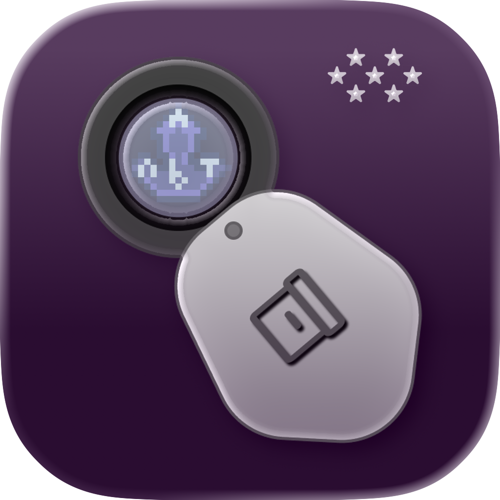

<p align="center">
  
  <br>
  <br>
  <b>neoNBTExplorer</b><br>
  A native cross-platform fork of NBTExplorer.<br><br>
  
  
  <br><br>
</p>

## But why?
A big chunk of the Minecraft community heavily depends on **NBTExplorer**. And although this shows its excellence, it's also starting to show its age and limited native platform support.

**neoNBTExplorer** tries to close that gap with the help of **.NET 10** and a GUI written from the ground up in **Avalonia**.

Right now we fully support **macOS**, **Windows** and **GNU/Linux**; and the idea is to eventually bring it to the web as well!


## How do I use it?
You can download the latest version for your operating system from the [Releases](https://github.com/neoNBTExplorer/neoNBTExplorer/releases) page. Make sure to download the one labelled **RELEASE**!

The **DEBUG** one is less performant (it's compiled **JIT** instead of **AOT**), and won't offer you anything useful if you're not, well, debugging!


## How do I build it?
That's also really easy!

First, you have to **clone the repo**. The `--recursive` flag here makes sure you also clone neoSubstrate!
```bash
git clone https://github.com/neoNBTExplorer/neoNBTExplorer --recursive
```
Then, assuming you already have the **.NET SDK** installed, you run this for a **RELEASE** build...

```bash
dotnet publish -c Release
```
...or this for a **DEBUG** one! Pretty easy!

```bash
dotnet publish -c Debug
```
.NET will tell you where the built binaries are! They're usually at `./NBTExplorer/bin/[BUILD TYPE]/net10.0/[YOUR OS]/publish/` if you can't find them, though! 

## Thank you!
I really need to thank **Justin Aquadro**. The original **NBTExplorer** keeps showing its excellence, and it's that excellence that made this project possible in the first place. We're a fork after all!

I also have to thank **copygirl** for **NBTEdit**, which was the pillar to the original NBTExplorer. A lot of people haven't heard of this project, but without it, history would be really different. Maybe NBTExplorer wouldn't have even existed! And without the original NBTExplorer, this project wouldn't have existed either!

I'm also really thankful to **amwx**. I'm not an experienced Avalonia developer, so I had quite the struggle getting my Dialogs to work. Thanks to amwx's work on the **FluentAvalonia** project, I could leave that roadblock behind, and was another critical pillar to make this project possible.

And although I don't depend on FluentAvalonia itself, I do depend on **.NET** and **Avalonia UI**. These projects are the backbone of neoNBTExplorer, so I'm really thankful for all the work the .NET Community and the Avalonia Community have done to make this possible.

Talking of the .NET Community, I'm also really thankful to **davidxuang** for the **FluentIcons** library, which helped give neoNBTExplorer its modern look. And I'm also thankful to **Serilog** and its contributors, which allowed neoNBTExplorer to easily expand its logging functionality.

Oh, and I have someone else to thank... **YOU**!

I'm a really small developer, and it's thanks to people like you that I can continue doing what I love. neoNBTExplorer is still a **really early project**, and it's your support which lets me continue iterating over it, and hopefully soon, reach full feature parity!


## FAQ
<details>
  <summary><b>macOS says the app is damaged!</b></summary>
  Yes, that's an annoying thing about macOS...
  <br>
  It actually isn't damaged, it's just <b>not signed</b>. I unfortunately don't have the money to justify signing it, so, after installing the app (moving it into <b>/Applications</b>) you'll have to run this command to be able to run it:

  ```bash
  xattr -d com.apple.quarantine /Applications/neoNBTExplorer.app
  ```
</details>
<details>
  <summary><b>Wait, "reach full feature parity"? What are you missing?</b></summary>
  From the original NBTExplorer, only one thing as far as I'm aware: the <b>find functionality</b>. With this I'm grouping both <b>searching and replacing tag values</b>, and the more specialised <b>Chunk Finder</b>.
  <br>
  But I'm also supposing there are certain things that the game introduced over the years that the original NBTExplorer never supported. We're reusing the same backend, so we don't support these either. That's the next step after we reach feature parity with the original, though!
</details>
<details>
  <summary><b>Avalonia UI? That means you could run in a web browser!</b></summary>
  Yup! And that's a <b>future step</b> we're <b>absolutely taking!</b> That way if you ever have to do a quick NBT edit on the go, you won't have to install the app! You'll also get all the same functionality as the original NBTExplorer, or potentially even more! All with the same familiar interface of neoNBTExplorer! Isn't that neat?
</details>
<details>
  <summary><b>What does the icon represent?</b></summary>
  I'm glad you asked, because it's a <b>double entendre</b>!
  <br>
  When I started working on it, my idea was to have a <b>2D loupe focusing on an amethyst</b>. I still see exactly that, and even added some details like a NBT-shaped sparkle. I went this route both because of my <b>love for the Earth Sciences</b>, and how looking at a gem with a loupe represents very well what a program like this does: magnify what's otherwise impossible to see.
  <br>
  But I showed this icon to a friend, and instead they saw a <b>tag</b>!
  <br>
  And guess what?! NBT means <b>Named Binary Tag</b>! So even though it's still a geoscience-y icon in my heart, it can be whatever you want it to!
</details>


## Attribution
If you need the legal version of my gratitude, you'll find it in the [**NOTICE.md**](./NOTICE.md) file! And all licenses are in the [**LICENSES/**](./LICENSES/) subdirectory.

The NBTExplorer subdirectory is entirely my own code, unless it is explicitly noted as not. Two examples of this are the Dialogs, which are derived from **FluentAvalonia**; and the **"reused infrastructure"**, which is derived from the original NBTExplorer.

All the other subdirectories are directly derived from the original NBTExplorer, and are mostly unmodified.