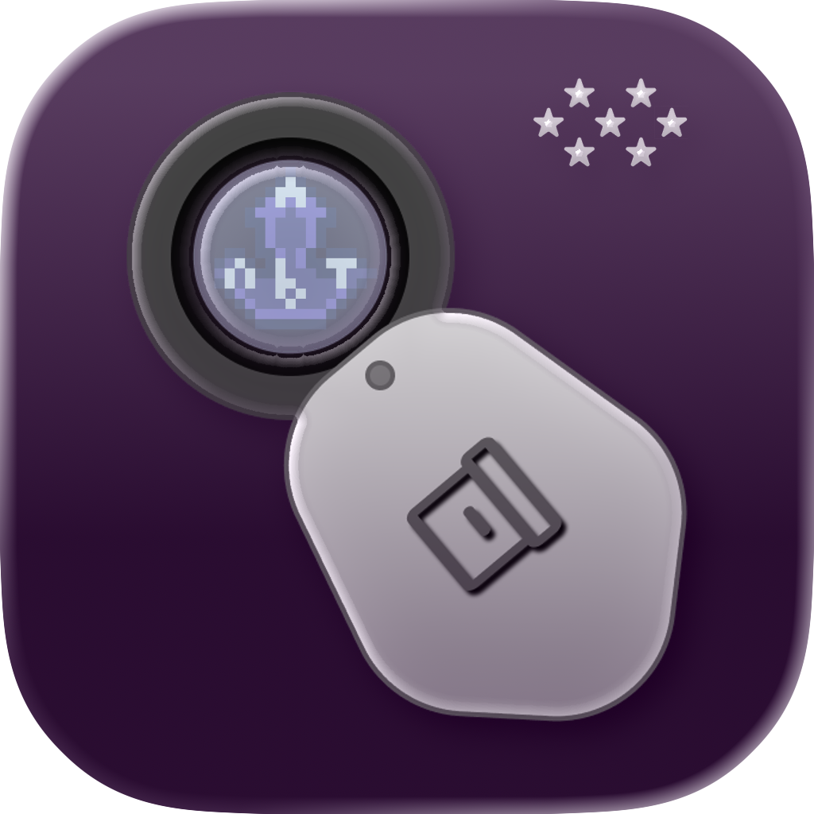

> [!CAUTION]
> **TRANSITION BRANCH**
> 
> This branch is where our **major restructuring** is happening, and it'll be **uncompilable** for a while. Please [read this announcement](https://github.com/NBTLoupe/NBTLoupe/discussions/4) for more information.
>
> Do note that this **README** currently reflects a **hypothetical future scenario**. Lots of the things mentioned in here **aren't true at the moment**, but will be once I remove this banner.
>

<p align="center">
  
  <br>
  <br>
  <b>NBTLoupe</b><br>
  The native NBT editor designed to be performant, modern, and cute.<br><br>
  
  
  <br><br>
</p>

## But why?
Most **NBT editors** are built strictly with **Windows** in mind, and although this is fine for most users, it's an obstacle for everyone else. The few **cross-platform alternatives** are unfortunately either **feature incomplete**, or have made **serious compromises** in their UI design.

**NBTLoupe** solves this with the help of **.NET 10** (**NAOT**!), and a GUI written from the ground up in **Avalonia**. As a result, we're a **performant NBT editor** with a really **modern UI**! The **cutest**, I dare to say! (And yes, cuteness is a valid reason for **Windows users** to give us a try!)

Right now we fully support **macOS**, **Windows**, and **GNU/Linux**; but you can also use it almost anywhere else through our **WASM** frontend (on the web!)


## How do I use it?
You can download the latest version for your operating system directly from [**our website**](https://nbtloupe.mallardluna.com/).

Alternatively, you can grab it from [**our GitHub Releases**](https://github.com/NBTLoupe/NBTLoupe/releases) page. If you do so, make sure to download the one labelled **RELEASE**!

The **DEBUG** one is less performant (it's compiled **JIT** instead of **AOT**), and won't offer you anything useful if you're not, well, debugging!


## How do I build it?
That's also really easy!

First, you have to **clone the repo**.
```bash
git clone https://github.com/NBTLoupe/NBTLoupe
```
Then, assuming you already have the **.NET SDK** installed, you run this for a **RELEASE** build...

```bash
dotnet publish -c Release
```
...or this for a **DEBUG** one! Pretty easy!

```bash
dotnet publish -c Debug
```
.NET will tell you where the built binaries are! They're usually at `./NBTLoupe/bin/[BUILD TYPE]/net10.0/[YOUR OS]/publish/` if you can't find them, though!


## FAQ
<details>
  <summary><b>macOS says the app is damaged!</b></summary>
  Yes, that's an annoying thing about macOS...
  <br>
  It actually isn't damaged, it's just <b>not signed</b>. I unfortunately don't have the money to justify signing it, so, after installing the app (moving it into <b>/Applications</b>) you'll have to run this command to be able to run it:

  ```bash
  xattr -d com.apple.quarantine /Applications/NBTLoupe.app
  ```
</details>
<details>
  <summary><b>What does the icon represent?</b></summary>
  I'm glad you asked, because it's a <b>double entendre</b>!
  <br>
  When I started working on it, my idea was to have a <b>2D loupe focusing on an amethyst</b>. I still see exactly that, and even added some details like an NBT-shaped sparkle. I went this route both because of my <b>love for the Earth Sciences</b>, and how looking at a gem with a loupe represents very well what a program like this does: magnify what's otherwise impossible to see.
  <br>
  But I showed this icon to a friend, and instead they saw a <b>tag</b>!
  <br>
  And guess what?! NBT means <b>Named Binary Tag</b>! So even though it's still a geoscience-y icon in my heart, it can be whatever you want it to!
</details>


## Thank you!
I really need to thank **Justin Aquadro**. The original **NBTExplorer** keeps showing its excellence, and it's that excellence that inspired this project (and powered it in its early days!)

I also have to thank **copygirl** for **NBTEdit**, which was the pillar to the original NBTExplorer. A lot of people haven't heard of this project, but without it, history would be really different. Maybe NBTExplorer wouldn't have even existed! And without the original NBTExplorer, this project wouldn't have existed either!

I'm also really thankful to **amwx**. I'm not an experienced Avalonia developer, so I had quite the struggle getting my Dialogs to work. Thanks to amwx's work on the **FluentAvalonia** project, I could leave that roadblock behind, and was another critical pillar to make this project possible.

And although I don't depend on FluentAvalonia itself, I do depend on **.NET** and **Avalonia UI**. These projects are the backbone of NBTLoupe, so I'm really thankful for all the work the .NET Community and the Avalonia Community have done to make this possible.

Talking of the .NET Community, I'm also really thankful to **davidxuang** for the **FluentIcons** library, which helped give NBTLoupe its modern look. And I'm also thankful to **Serilog** and its contributors, which allowed NBTLoupe to easily expand its logging functionality.

Oh, and I have someone else to thank... **YOU**!

I'm a really small developer, and it's thanks to people like you that I can continue doing what I love. NBTLoupe is still a **fairly niche project**, and it's your support which lets me continue iterating over it!


## Attribution
If you need the legal version of my gratitude, you'll find it in the [**NOTICE.md**](./NOTICE.md) file! That file will also guide you to the respective **LICENSE** files.

Everything in this repository is entirely my own code, unless it is explicitly noted as not. The main example of this are the Dialogs, which are derived from **FluentAvalonia**.

This is because, as part of our [**major restructuring**](https://github.com/NBTLoupe/NBTLoupe/discussions/4), all legacy code derived from **NBTExplorer** and **Substrate** has been **completely removed** from this repository.
